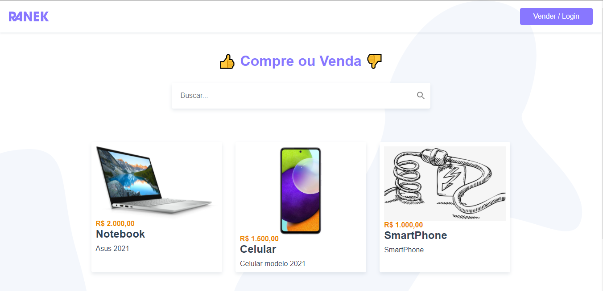
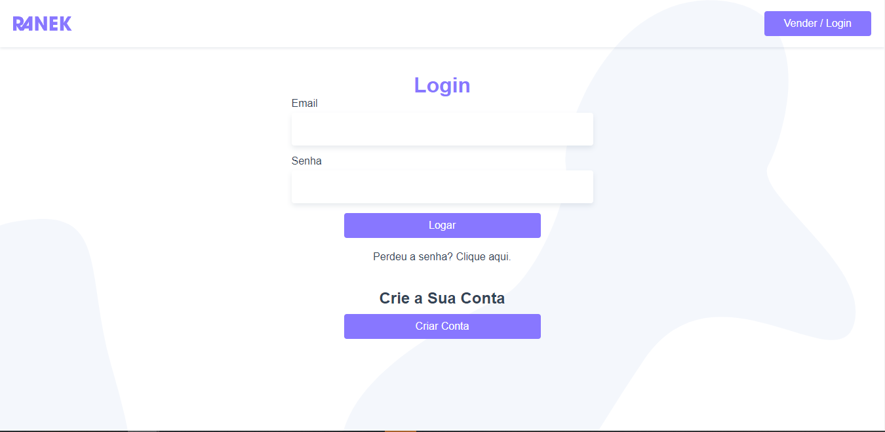
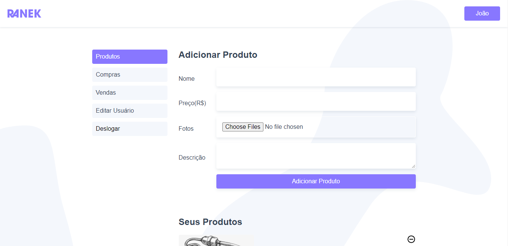
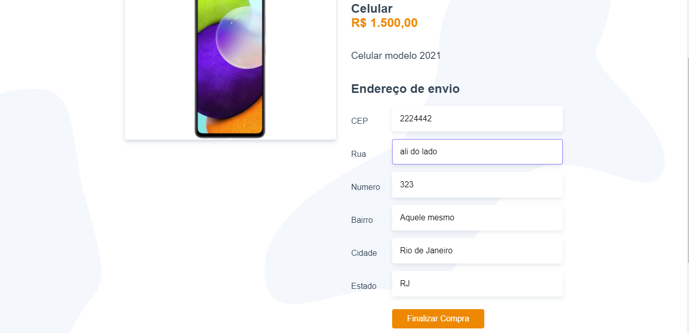
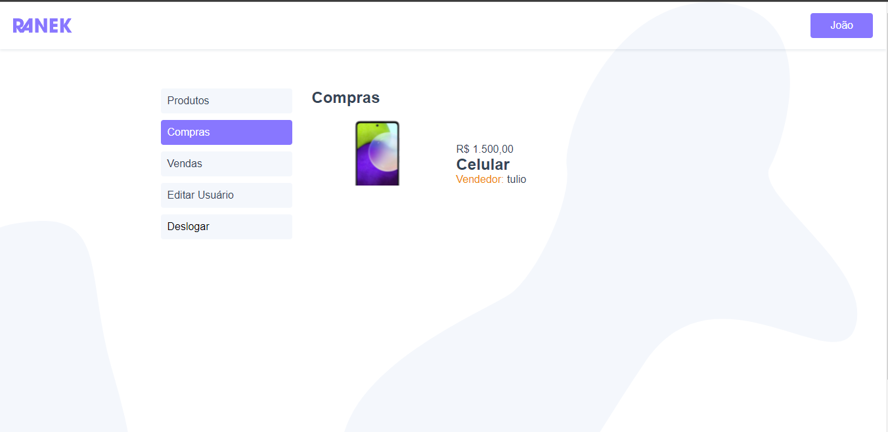

# Sobre o que é o projeto
- Projeto com foco na criação de uma página e-commerce. Com login e cadastro de usuários e produtos.
- Projeto final do curso Vue.js 2, da Origamid.
- Estão sendo utilizadas todas as ferramentas dispostas do framework Vue.js, como Vue Router, Vuex, Hooks, Transitions. Também estão sendo aplicados conceitos de CSS e HTML.

### Screenshots

- Home:

 
 
- Login:



- Adicionar Produtos:




- Comprar Produto




- Compras



Você pode conferir mais algumas imagens do projeto em [Screenshots](https://github.com/tuliofernando8/Ranek/tree/main/src/assets/screenshots).

# Comunicação Backend
 - A comunicação é feita através do programa XAMP e todo o backend foi feito utilizando Php e Wordpress.
 
### Como configurar a comunicação
- Realizar toda a configuração descrita no repositório "ranek_wordpress".
- Abrir o XAMPP e deixar rodando os servidores "Apache" e "MySQL"


# Setups básicos

## Project setup

```
npm install
```

### Compiles and hot-reloads for development

```
npm run serve
```

### Compiles and minifies for production

```
npm run build
```

### Lints and fixes files

```
npm run lint
```

### Customize configuration

See [Configuration Reference](https://cli.vuejs.org/config/).
